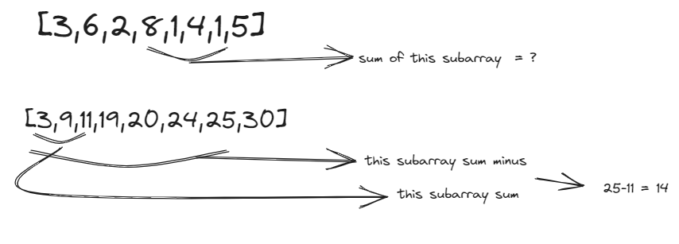

## Two Pointers

```python
def twopointer(arr):
    left = 0
    right = len(arr) -1
    while left< right:
        #do some logic depending on the problem
        #do some more logic to decide on one of the following
        1:left +=1
        2:right-=1
        3:both left +=1 right -=1

```

the strength of this technique is we will never have more than $O(n)$ iterations

### Another Approach

Move along both the inputs simultaneously untill all elements have been checked

```python
def twopointers(arr1, arr2):
    i = j = 0
    while i < len(arr1) and j < len(arr2):
        # do some logic here depending on the problem
        # do somemore logic to decide on one of the fallowing
        1. i += 1
        2. j += 1
        3. both i += 1 and j += 1
    # step 4 : make sure both iterables are exhausted
    # step 5 : nothe the obly one of thes loops would run
    while i < len(arr1)
	    # do some logic
	    i += 1
    while j < len(arr2):
			#do some logic
      j += 1
```

Two pointers can be either in same directions or in opposite direction

## Sliding Window

subarray : contiguos section of the array

```python
arr = [1,2,3,4]
#subarrays
[1],[2],[3],[4]
[1,2],[2,3],[3,4]
[1,2,3],[2,3,4]
[1,2,3,4]
```

Subarrays can be defined by 2 indices , the start and the end. Lets call the starting index as left bound and the ending index as right bound.

Another name for subarray in this context is “Sliding window”

intially we have left =right =0 which means that the 1st subarray we look at is just the first element of the array on it’s own . We want to expand the size of our window and we do that by incrementing “right” . When we increment right this is like adding new element to our window

But what if after adding a new element the subarray becomes invalid? we need to “remove” some elements from our window untill it becomes valid again . To remove elements we can increment left which shriks our window

As we add and remove elements , we are sliding our window along the input from left to right

### Psuedocode

```python
def sliding(arr):
    left = 0
    for right in range(len(arr)):
        # do some logic to "add" element at arr[right] to window
        while window_is_invalid:
            # do some logic to remove element at arr[left] from window
            left += 1
        # do some logic to update the answer
```

Sliding window need 2 variables apart from left,right . one(curr) to track the current window and the other (ans) to get the max or final anwer

### Fixed Window Size

```python
def sliding(arr,k):
    curr = #some data to track the window
    #build the 1st window
    for i in range(k):
        #do something with curr or other variables to build 1st window
    ans = #answer variable probably equal to curr here depending on the problem
    for i in range(k,len(arr)):
        #add arr[i] to the window
        #remove arr[i-k] from window
        #update ans
    return ans
```

many sliding window problems will also need to use a hashmap

## Prefix sum:

Technique that can be used on arrays (of numbers)

the idea is to create an array “prefix” where prefix[i] id the sum of all elements up to the index i (inclusive)

This allows us to find the sum of any subarray in $O(1)$

If we want the sum of the subarray from i to j (inclusive), then the answer is prefix[j]-prefix[i-1] or prefix[i] + num[i] if you don’t want to deal with the out of bounds case when i=0

This works beacuse prefix[i-1] is the sum of all elements before index i



### Building prefix sum:

```python
# Given an array arr
prefix = [nums[0]]
for i in range(len(arr)):
    prefix.append(nums[i]- prefix[len(prefix)-1])

        or

prefix = [nums[0]]
for i in range(len(arr)):
    prefix.append(nums[i]+prefix[-1])
```

## $o(n)$ string building

```python
		def build_string(s):
    arr = []
    for c in s:
        arr.append(c)
    return "".join(arr)
```

Subarrays/Substrings : contiguous section of an array or string

Subsequences : set of elements of an array/String that kept the same relatice order but does’nt need t be contiguous

```python
#subsequences of [1,2,3,4]
[1,3],[4],[],[2,3]
#but not [3,2],[5],[4,1]
```

Subsets : Any set of elements from the original arary or string .The order does’nt matter and neither do the elements baing beside each other
