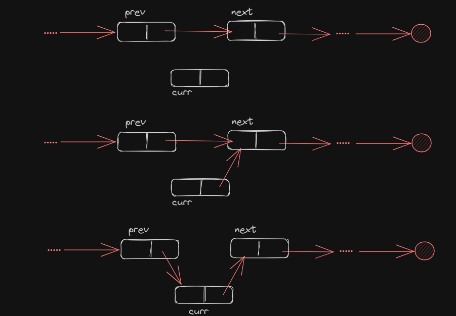

# Linked Lists

```python
class listNode:
    def __init__(self,val):
        self.val = val
        self.next = None
one = listNode(1)
two = listNode(2)
three = listNode(3)

one.next = two
two.next = three
head = one

head.val  #1
head.next.val #2
head.next.next.val #3
```

### Advantages

Add and remove at any positions in $O(1)$. Provided you have the reference to a node at the position in which you want to perform the operation otherwise the operation in $O(n)$

### Disadvantages

No Random access

### Chaining .next

If ypu have multiple .next for example [head.next.next](http://head.next.next) everything before the final .next refer to one node

 

```python
1->2->3
head.next.next
#we are actually referring to 2.next because head.next is the 2
```

### Traversal

```python
def getsum(head):
    ans = 0
    while head :
        ans += head
        head = head.next
    return ans
```

The final node’s next pointer is null .Therefore after doing “head =head.next” at the final node, head becomes null and the while loop ends

### Recursive Traversal

```python
def getsum(head):
    if not head :
        return 0
    return head.val+=getsum(head.next)
```

### Adding Nodes at position i

```python
def addNode(prevnode,node_to_add):
    node_to_add.next = prevnode.next
    prevnode.next = node_to_add
```



unlike an array , we don’t need to move all elements past the inserted elements .Therefore, we can insert a new node into a linked list in $O(1)$  time complexity if we have a reference to the prev node

### Delete node at i

```python
def deleteNode(prevnode):
    prevnode.next = prevnode.next.next
```


### Dummy Pointers

```python
def getsum(node):
    ans = 0
    dummy = head
    while dummy:
        ans += dummy.val
        dummy = dummy.next
    return ans
```

using the dummy  pointer allows us to traverse the linked list without loosing the reference to the head

 

## Linked List Cycle (Floyd’s cycle finding algorithm):

```python
def hasCycle(self, head: Optional[ListNode]) -> bool:
    slow = head
    fast = head
    while fast and fast.next:
        slow = slow.next
        fast = fast.next.next
        if slow == fast:
            return True
    return False
```

This approach gives us a time complexity of $O(n)$ and a space complexity of $O(1)$, where `n` is the number of nodes in the linked list. Note that this problem can also be solved using hashing, although it would require $O(n)$ space.

### Return the Node where the cycle starts in Linked List(hashing solution for cycle)

```python
def hasCycle(self, head: Optional[ListNode]) -> bool:
    seen = set()
    while head:
        if head in seen:
            return head.val# return True -- for cycle finding
        seen.add(head)
        head = head.next
        return False
```

The hashing solution: if you continuously iterate using the `next` pointer, there are two possibilities:

1. If the linked list doesn't have a cycle, you will eventually reach `null` and finish.
2. If the linked list has a cycle, you will eventually visit a node twice. We can use a set to detect this.

### Reversing a Linked List

```python
# Leetcode -206
def reverseList(self, head: Optional[ListNode]) -> Optional[ListNode]:
    prev = None
    curr = head
    while curr:
        temp = curr.next
        curr.next = prev
        prev = curr
        curr = temp
    return prev
```

While traversing the list we can change the current node’s next pointer to point to it’s previous element 

Since a node does not have reference to it’s previous node, we must store it’s previous element beforehand

We also need another pointer to store the next node before changing the reference

Do not forget to return the new head referenced at the end

Time Complexity : $O(n)$

Space Complexity : $O(1)$


### middle of linked list

```python
def linkedlist(self, head: Optional[ListNode]) -> Optional[ListNode]:
    slow = fast = head
    while fast and fast.next:
        slow = slow.next
        fast = fast.next.next
    return slow
```