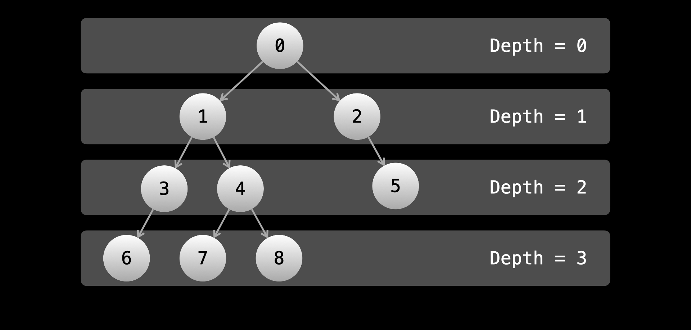

# Binary Trees - BFS

In DFS, we prioritized depth. In breadth-first search (BFS), we prioritize breadth. Recall that a node's depth is its distance from the root. In DFS, we always tried to go down as far as we could, increasing the depth of the current node until we reached a leaf. If you performed DFS on a large tree, the depth of the nodes you would traverse may look something like 0, 1, 2, 3, 4, 5, 6, ....

In BFS, we traverse all nodes at a given depth before moving on to the next depth. So if you performed BFS on a large complete binary tree, the depth of the nodes you would traverse would look like 0, 1, 1, 2, 2, 2, 2, 3, 3, ....

We can think of each depth of a tree as a "level", as if the tree was a building with the root being the top floor and the edges were staircases down to a lower floor.



A BFS performed on the above tree would visit the nodes in the same order as their values. We visit all nodes at a depth d before visiting any node at a depth of d + 1.

While DFS was implemented using a stack (recursion uses a stack under the hood), BFS is implemented iteratively with a queue. You can implement BFS with recursion, but it wouldn't make sense as it's a lot more difficult without any benefit.

## When to Use BFS vs DFS ?

We mentioned earlier that in many problems, it doesn't matter if you choose preorder, inorder, or postorder DFS, the important thing is that you just visit all nodes. If you have a problem like this, then it doesn't matter if you use BFS either, because every "visit" to a node will store sufficient information irrespective of visit order.

Because of this, in terms of binary tree algorithm problems, it is very rare to find a problem that using DFS is "better" than using BFS. However, implementing DFS is usually quicker because it requires less code, and is easier to implement if using recursion, so for problems where BFS/DFS doesn't matter, most people end up using DFS.

On the flip side, there are quite a few problems where using BFS makes way more sense algorithmically than using DFS. Usually, this applies to any problem where we want to handle the nodes according to their level. We'll see this in the upcoming example and practice problems.

In an interview, you may be asked some trivia regarding BFS vs DFS, such as their drawbacks. The main disadvantage of DFS is that you could end up wasting a lot of time looking for a value. Let's say that you had a huge tree, and you were looking for a value that is stored in the root's right child. If you do DFS prioritizing left before right, then you will search the entire left subtree, which could be hundreds of thousands if not millions of operations. Meanwhile, the node is literally one operation away from the root. The main disadvantage of BFS is that if the node you're searching for is near the bottom, then you will waste a lot of time searching through all the levels to reach the bottom.

In terms of space complexity, if you have a complete binary tree, then the amount of space used by the recursive call stack for DFS is linear with the height, which is logarithmic with n (the number of nodes). The amount of space used by the queue is linear with n, so DFS has a much better space complexity. The reason the queue will grow linearly is because the final level in a complete binary tree can have up to *n/2*​ nodes.

However, if you have a lopsided tree (like a straight line), then BFS will have an _O(1)_ space complexity while DFS will have
_O(n)_ (although, a lopsided tree is an edge case whereas a full tree is the expectation).

## BFS Code Implementation

```python
from collections import deque

def print_all_nodes(root):
    queue = deque([root])
    while queue:
        nodes_in_current_level = len(queue)
        # do some logic here for the current level

        for _ in range(nodes_in_current_level):
            node = queue.popleft()

            # do some logic here on the current node
            print(node.val)

            # put the next level onto the queue
            if node.left:
                queue.append(node.left)
            if node.right:
                queue.append(node.right)
```

At the start of each iteration inside the while loop (where the comment "do some logic here for the current level" is), the queue contains exactly all the nodes for the current level. In the beginning, that's just the root.

We then use a for loop to iterate over the current level. We store the number of nodes in the current level nodesInCurrentLevel before iterating to make sure the for loop doesn't iterate over any other nodes. The for loop visits each node in the current level and puts all the children (the next level's nodes) in the queue.

Because we are removing from the left and adding on the right (opposite ends), after the for loop finishes, the queue will hold all the nodes in the next level. We move to the next while loop iteration and the process repeats.

With an efficient queue, the dequeue and enqueue operations are _O(1)_, which means that the time complexity of BFS is the same as DFS. Again, the main idea is that we visit each node only once, so the time complexity is _O(n⋅ k)_ where
n is the total number of nodes, and k is the amount of work we do at each node, usually _O(1)_
